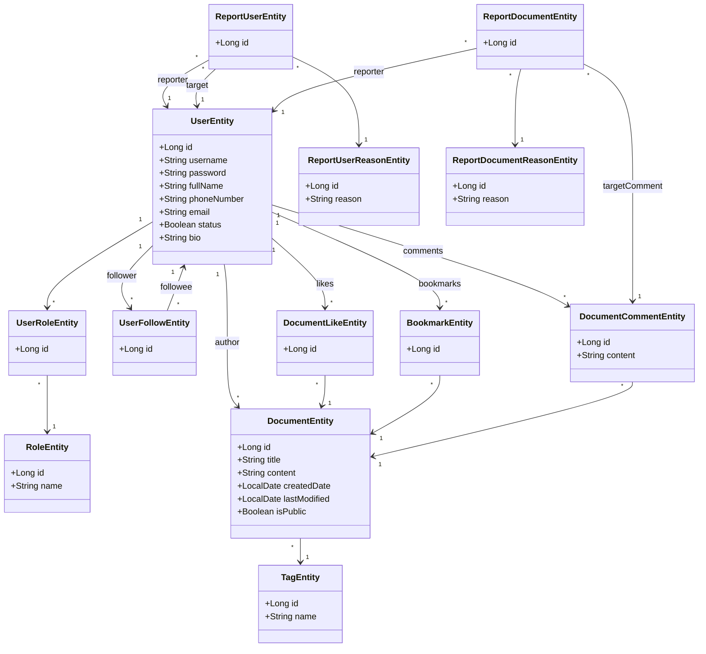
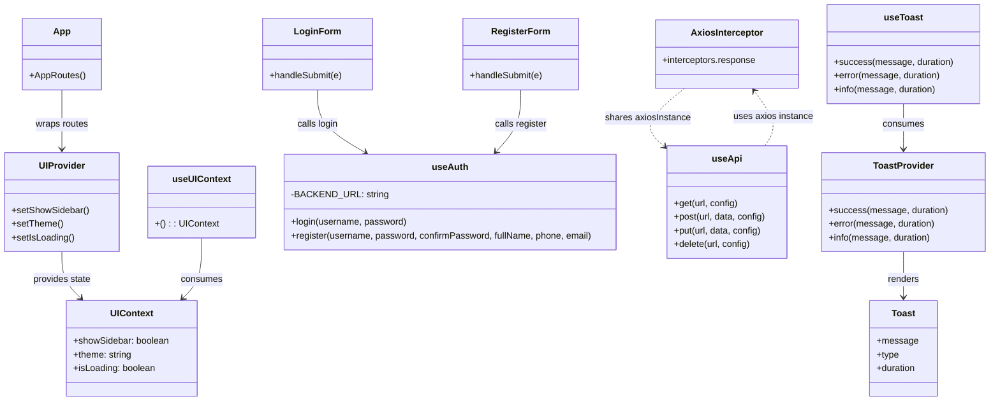

# 📘 WritExploit API Documentation

- **Base URL:** `https://api.example.com/api/`
- **Version:** `v1`
- **Authentication:** JWT Bearer Token (`Authorization: Bearer <token>`)
- **Content-Type:** `application/json`
- **Common Status Codes:**
  - `200` OK
  - `201` Created
  - `204` No Content
  - `400` Bad Request
  - `401` Unauthorized
  - `403` Forbidden
  - `404` Not Found
  - `500` Internal Server error
------------------------------------------------------------------------------------------

## 🔐 Authentication

### Register (checked)

 
<code>POST</code> <code><b>auth/register</b></code> <code>(Create new user)</code>

##### Parameters

> | name       | type      | data type | description        |
> |------------|-----------|-----------|--------------------|
> | `username`    | required  | string    | Username  |
> | `password` | required  | string    | Password      |
> | `fullname`     | required  | string    | Display name       |
> | `phone`     | optional  | string    | Phone number       |
> | `email`    | required  | string    | User email  
##### Responses

> | http code | content-type            | response                                               |
> |-----------|-------------------------|--------------------------------------------------------|
> | `201`     | `application/json`      | `{ "message": "Account created"}`  |
> | `400`     | `application/json`      | `{ "error": "Invalid input" }`                         |

---

### Login (checked)

 
<code>POST</code> <code><b>auth/login</b></code> <code>(Authenticate & issue JWT)</code>

##### Parameters

> | name       | type      | data type | description       |
> |------------|-----------|-----------|-------------------|
> | `username`    | required  | string    | Username        |
> | `password` | required  | string    |Password     |

##### Responses

> | http code | content-type            | response                                                      |
> |-----------|-------------------------|---------------------------------------------------------------|
> | `200`     | `application/json`      | `{ "accessToken":"xxx.yyy.zzz", "refreshToken":xxx }`           |
> | `401`     | `application/json`      | `{ "error": "Invalid credentials" }`                          |

---

### Refresh Token

 
<code>POST</code> <code><b>auth/refresh</b></code> <code>(Get new access token from refresh token)</code>

##### Parameters

> | name            | type     | data type | description                                              |
> |-----------------|----------|-----------|----------------------------------------------------------|
> | `refreshToken`  | required | string    | Valid refresh token (cookie or body/header)             |

##### Responses

> | http code | content-type            | response                                                                      |
> |-----------|-------------------------|-------------------------------------------------------------------------------|
> | `200`     | `application/json`      | `{ "accessToken":"eyJhbGciOi..." }`                          |
> | `401`     | `application/json`      | `{ "error":"Invalid or expired refresh token" }`                              |
> | `403`     | `application/json`      | `{ "error":"Token revoked or already used" }`                                 |

---

### Logout

 
<code>POST</code> <code><b>auth/logout</b></code> <code>(Revoke current refresh token)</code>

##### Parameters

> | name            | type     | data type | description                          |
> |-----------------|----------|-----------|--------------------------------------|
> | `refreshToken`  | require | string    | Token to revoke (if applicable)      |

##### Responses

> | http code | content-type            | response                                  |
> |-----------|-------------------------|-------------------------------------------|
> | `200`     | `application/json`      | `{ "message":"Logged out" }` or `{"OK"}`  |
> | `401`     | `application/json`      | `{ "error":"Unauthorized or invalid token"}` |

------------------------------------------------------------------------------------------

## 👤 Users (Profile)

### Get Current User Profile

 
<code>GET</code> <code><b>/users/me</b></code>🔒<code>(Get own profile)</code>

##### Parameters

> | name     | type | data type | description |
> |----------|------|-----------|-------------|
> | `Authorization` | required | `Bearer <access_token>` | |
##### Responses

> | http code | content-type            | response                                                                 |
> |-----------|-------------------------|--------------------------------------------------------------------------|
> | `200`     | `application/json`      | `{ "username":"u_123","email":"a@b.com","fullname":"John","phone":"000", "bio":"..."}` |
> | `401`     | `application/json`      | `{ "error":"Unauthorized" }`                                             |

---

### Update Profile

 
<code>PUT</code> <code><b>/users/me</b></code>🔒<code>(Update own profile)</code>

##### Parameters

> | name     | type | data type | description |
> |----------|------|-----------|-------------|
> | `Authorization` | required | `Bearer <access_token>` | |
##### Responses

> | http code | content-type            | response                                              |
> |-----------|-------------------------|-------------------------------------------------------|
> | `200`     | `application/json`      | `{ "id":"u_123","name":"John","bio":"...", "phone": "...", "avatar":""}` |
> | `401`     | `application/json`      | `{ "error":"Unauthorized" }`                         |

---

### Get Public User Profile

 
<code>GET</code> <code><b>/users/{userId}</b></code> <code>(View another user's public profile)</code>

##### Parameters

> | name     | type | data type | description |
> |----------|------|-----------|-------------|
> | `userId` | path | string    | User ID     |

##### Responses

> | http code | content-type            | response                                                                      |
> |-----------|-------------------------|-------------------------------------------------------------------------------|
> | `200`     | `application/json`      | `{ "id":"...","fullname":"Jane","bio":"...","avatar": "...", "publicNotes":[{ "id":"n1",...}] }` |
> | `404`     | `application/json`      | `{ "error":"User not found" }`                                                |

### Delete Account (Soft Delete)

 
<code>POST</code> <code><b>/users/me</b></code>🔒<code>(Deactivate account)</code>

*Logic: Yêu cầu password xác nhận. Tài khoản sẽ bị vô hiệu hóa (soft delete) và lên lịch xóa vĩnh viễn sau 30 ngày.*

##### Parameters

> | name | type | data type | description |
> |---|---|---|---|
> | `password` | body | string | Password |

##### Responses

> | http code | content-type | response |
> |---|---|---|
> | `200` | `application/json` | `{ "message": "Account deactivated. Will be deleted in 30 days." }` |
> | `401` | `application/json` | `{ "error": "Incorrect password" }` |

------------------------------------------------------------------------------------------

## 📝 Documents (CRUD) 

### Create Document (checked)

 
<code>POST</code> <code><b>/documents</b></code>🔒<code>(Create new document)</code>

##### Parameters

> | name        | type      | data type | description                         |
> |-------------|-----------|-----------|-------------------------------------|
> | `Authorization` | required | `Bearer <access_token>` | |
> | `title`     | required  | string    | Document title                          |
> | `content`   | optional  | string    | Markdown content                    |
> | `tags`      | optional  | array     | Tags array                          |
> | `isPublic`  | optional  | boolean   | Default false (private)             |

##### Responses

> | http code | content-type            | response                                                                 |
> |-----------|-------------------------|--------------------------------------------------------------------------|
> | `201`     | `application/json`      | `{ "id":"note_123","title":"My Note","tags":[],"isPublic":false }`       |
> | `400`     | `application/json`      | `{ "error": "Title is required" }`                                       |
> | `401` | `application/json` | `{ "error": "Unauthorized" }` |

---

### Get Document

 
<code>GET</code> <code><b>/documents/{id}</b></code> <code>(Get document details)</code>

##### Parameters

> | name | type  | data type | description |
> |------|-------|-----------|-------------|
> | `id` | path  | string    | Document ID     |

##### Responses

> | http code | content-type            | response                                                                                   |
> |-----------|-------------------------|--------------------------------------------------------------------------------------------|
> | `200`     | `application/json`      | `{ "id":"note_123","title":"My Note","content":"...","tags":[],"isPublic":false,"owner":{"id":"u_123","name":"John"},"teamId":null,"created_at":"...","updated_at":"..." }` |
> | `404`     | `application/json`      | `{ "error":"Note not found" }`                                                             |

---

### List Own Documents

 
<code>GET</code> <code><b>/documents</b></code>🔒<code>(List documents of current user)</code>

##### Query Parameters

> | name  | type     | data type | description      |
> |-------|----------|-----------|------------------|
> | `Authorization` | required | `Bearer <access_token>` | |
> | `tag` | optional | string    | Filter by tag    |
> | `q`   | optional | string    | Full-text search |

##### Responses

> | http code | content-type            | response                                                        |
> |-----------|-------------------------|-----------------------------------------------------------------|
> | `200`     | `application/json`      | `[{"id":"n1","title":"A","tags":["x"],"isPublic":false,"updated_at":"..."}]` |
> | `401` | `application/json` | `{ "error": "Unauthorized" }` |

---

### List Public Documents

 
<code>GET</code> <code><b>/documents/public</b></code> <code>(Explore public documents)</code>

##### Responses

> | http code | content-type            | response                                                           |
> |-----------|-------------------------|--------------------------------------------------------------------|
> | `200`     | `application/json`      | `[{"id":"n1","title":"Public","owner":{"id":"u_234","name":"Jane"}}]` |

---

### Update Document

 
<code>PUT</code> <code><b>/documents/{id}</b></code>🔒<code>(Update document)</code>

##### Parameters

> | name       | type  | data type | description        |
> |------------|-------|-----------|--------------------|
> | `Authorization` | required | `Bearer <access_token>` | |
> | `title`    | optional  | string    | Updated title      |
> | `content`  | optional  | string    | Updated markdown   |
> | `tags`     | optional  | array     | Updated tags       |
> | `isPublic` | optional  | boolean   | Updated visibility |

##### Responses

> | http code | content-type            | response                               |
> |-----------|-------------------------|----------------------------------------|
> | `200`     | `application/json`      | `{ "message":"Document updated" }`         |
> | `403`     | `application/json`      | `{ "error":"Not owner of document" }`      |
> | `401` | `application/json` | `{ "error": "Unauthorized" }` |

---

### Delete Document

 
<code>DELETE</code> <code><b>/documents/{id}</b></code>🔒<code>(Delete document)</code>

##### Parameters
> | name | type | data type | description |
> |------|------|-----------|-------------|
> | `Authorization` | required | `Bearer <access_token>` | |
> | `id` | path | string    | Document ID     |

##### Responses

> | http code | content-type            | response            |
> |-----------|-------------------------|---------------------|
> | `204`     | `application/json`      | *No content*        |
> | `403`     | `application/json`      | `{ "error":"Forbidden" }` |
> | `401` | `application/json` | `{ "error": "Unauthorized" }` |

------------------------------------------------------------------------------------------

## 🧠 AI Refine

 
<code>POST</code> <code><b>/documents/{id}/refine</b></code>🔒<code>(Refine document content using AI)</code>

##### Parameters

> | name      | type     | data type | description                      |
> |-----------|----------|-----------|----------------------------------|
> | `Authorization` | required | `Bearer <access_token>` | |
> | `action`  | optional | string    | `"improve"` or `"summarize"`     |
> | `content` | optional | string    | Original content (override)      |

thêm 1 route AI: suggestion (text completion, tag suggestion, refine), chatbot, template+

##### Responses

> | http code | content-type            | response                                         |
> |-----------|-------------------------|--------------------------------------------------|
> | `200`     | `application/json`      | `{ "refinedContent":"# Improved Markdown..." }`  |
> | `401` | `application/json` | `{ "error": "Unauthorized" }` |

### AI Chat / Assistant

 
<code>POST</code> <code><b>/ai/chat</b></code>🔒<code>(Chat with context of a document)</code>

##### Parameters

> | name | type | data type | description |
> |---|---|---|---|
> | `Authorization` | required | `Bearer <access_token>` | |
> | `documentId` | body | string | Context document ID (optional) |
> | `message` | body | string | User question |

##### Responses

> | http code | content-type | response |
> |---|---|---|
> | `200` | `application/json` | `{ "reply": "Based on your note, user X is..." }` |
> | `401` | `application/json` | `{ "error": "Unauthorized" }` |

### AI Suggest Tags

 
<code>POST</code> <code><b>/ai/tags</b></code>🔒<code>(Auto-suggest tags based on content)</code>

##### Parameters

> | name | type | data type | description |
> |---|---|---|---|
> | `Authorization` | required | `Bearer <access_token>` | |
> | `content` | body | string | Text to analyze |

##### Responses

> | http code | content-type | response |
> |---|---|---|
> | `200` | `application/json` | `{ "tags": ["react", "javascript", "frontend"] }` |
> | `401` | `application/json` | `{ "error": "Unauthorized" }` |

### AI Generate / Template

 
<code>POST</code> <code><b>/ai/generate</b></code>🔒<code>(Generate content from prompt/template)</code>

##### Parameters

> | name | type | data type | description |
> |---|---|---|---|
> | `Authorization` | required | `Bearer <access_token>` | |
> | `type` | body | string | `blog`, `summary`, `email`, `code` |
> | `prompt` | body | string | Key points or instruction |

##### Responses

> | http code | content-type | response |
> |---|---|---|
> | `200` | `application/json` | `{ "content": "# Generated Blog Post\n\nHere is..." }` |
> | `401` | `application/json` | `{ "error": "Unauthorized" }` |

------------------------------------------------------------------------------------------

## 📤 Upload

 
<code>POST</code> <code><b>/upload</b></code>🔒<code>(Upload a file to embed in documents)</code>

##### Parameters

> | name   | type      | data type | description                    |
> |--------|-----------|-----------|--------------------------------|
> | `Authorization` | required | `Bearer <access_token>` | |
> | `file` | form-data | file      | Image/file to upload (≤5MB)    |

##### Responses

> | http code | content-type            | response                                                   |
> |-----------|-------------------------|------------------------------------------------------------|
> | `200`     | `application/json`      | `{ "url":"https://cdn.example.com/uploads/file.png" }`     |
> | `401` | `application/json` | `{ "error": "Unauthorized" }` |

------------------------------------------------------------------------------------------

## 🔍 Search

 
<code>GET</code> <code><b>/search</b></code> <code>(Search for documents)</code>

##### Parameters

> | name | type  | data type | description            |
> |------|-------|-----------|------------------------|
> | `q`  | query | string    | Keyword to search      |

##### Responses

> | http code | content-type            | response                                                             |
> |-----------|-------------------------|----------------------------------------------------------------------|
> | `200`     | `application/json`      | `[{"id":"note_1","title":"Keyword Match","owner":{"name":"User"}}]`  |

------------------------------------------------------------------------------------------

## Community
### View Public Documents

    
<code>GET</code> <code><b>/view-all-docs?tagid={tagid}&page={page}</b></code> <code>(View public documents)</code>

##### Parameters

> | name | type  | data type | description            |
> |------|-------|-----------|------------------------|
> | `tagid`  | query | string    | Tag ID                 |
> | `page`  | query | string    | Page number            |

##### Response

> | http code | content-type            | response                                                             |
> |-----------|-------------------------|----------------------------------------------------------------------|
> | `200`     | `application/json`      | `[{"id":"note_1","title":"Keyword Match", "snipet_content": "This is the content...","owner":{"name":"User"}}]`  |
> | `403`     | `application/json`      | `{ "error": "Forbidden" }` |

------------------------------------------------------------------------------------------

### View Document

    
<code>GET</code> <code><b>/view-doc?docid={docid}</b></code> <code>(View specific document)</code>

##### Parameters

> | name | type  | data type | description            |
> |------|-------|-----------|------------------------|
> | `docid`  | query | string    | Document ID            |

##### Response

> | http code | content-type            | response                                                             |
> |-----------|-------------------------|----------------------------------------------------------------------|
> | `200`     | `application/json`      | `{ "id":"note_1","title":"Keyword Match", "content": "This is the full content.","owner":{"name":"User"}}`  |
> | `403`     | `application/json`      | `{ "error": "Forbidden" }` |
> | `404`     | `application/json`      | `{ "error": "Not Found" }` |

------------------------------------------------------------------------------------------

### Like Document

    
<code>POST</code> <code><b>/documents/{id}/like</b></code>🔒<code>(Like a document)</code>

##### Parameters

> | name | type | data type | description |
> |---|---|---|---|
> | `Authorization` | required | `Bearer <access_token>` | |
> | `id` | path | string | Document ID |

##### Response

> | http code | content-type | response |
> |---|---|---|
> | `200` | `application/json` | `{ "message": "Liked", "likesCount": 129 }` |
> | `401` | `application/json` | `{ "error": "Unauthorized" }` |
> | `404` | `application/json` | `{ "error": "Not Found" }` |

------------------------------------------------------------------------------------------

### Unlike Document

    
<code>DELETE</code> <code><b>/documents/{id}/like</b></code>🔒<code>(Unlike a document)</code>

##### Parameters

> | name | type | data type | description |
> |---|---|---|---|
> | `Authorization` | required | `Bearer <access_token>` | |
> | `id` | path | string | Document ID |

##### Response

> | http code | content-type | response |
> |---|---|---|
> | `200` | `application/json` | `{ "message": "Unliked", "likesCount": 128 }` |
> | `401` | `application/json` | `{ "error": "Unauthorized" }` |
> | `404` | `application/json` | `{ "error": "Not Found" }` |

------------------------------------------------------------------------------------------

### Add Comment

    
<code>POST</code> <code><b>/documents/{id}/comments</b></code>🔒<code>(Add a comment)</code>

##### Parameters

> | name | type | data type | description |
> |---|---|---|---|
> | `Authorization` | required | `Bearer <access_token>` | |
> | `id` | path | string | Document ID |
> | `content` | body | string | Comment content |

##### Response

> | http code | content-type | response |
> |---|---|---|
> | `201` | `application/json` | `{ "id": "c1", "content": "Great post!", "author": {"id": "u1", "name": "User"}, "created_at": "2023-10-27T10:00:00Z" }` |
> | `401` | `application/json` | `{ "error": "Unauthorized" }` |
> | `404` | `application/json` | `{ "error": "Not Found" }` |

------------------------------------------------------------------------------------------

### Get Comments

    
<code>GET</code> <code><b>/documents/{id}/comments</b></code> <code>(Get document comments)</code>

##### Parameters

> | name | type | data type | description |
> |---|---|---|---|
> | `id` | path | string | Document ID |
> | `page` | query | integer | Page number (optional) |

##### Response

> | http code | content-type | response |
> |---|---|---|
> | `200` | `application/json` | `[{"id": "c1", "content": "Great post!", "author": {"id": "u1", "name": "User"}, "created_at": "2023-10-27T10:00:00Z"}]` |
> | `404` | `application/json` | `{ "error": "Not Found" }` |

### Reply to Comment

    
<code>POST</code> <code><b>/comments/{id}/replies</b></code>🔒<code>(Reply to a comment)</code>

##### Parameters

> | name | type | data type | description |
> |---|---|---|---|
> | `Authorization` | required | `Bearer <access_token>` | |
> | `id` | path | string | Parent Comment ID |
> | `content` | body | string | Reply content |

##### Response

> | http code | content-type | response |
> |---|---|---|
> | `201` | `application/json` | `{ "id": "r1", "content": "I agree!", "author": {"name": "User2"}, "created_at": "2023-10-27T10:05:00Z" }` |
> | `401` | `application/json` | `{ "error": "Unauthorized" }` |
> | `404` | `application/json` | `{ "error": "Not Found" }` |

------------------------------------------------------------------------------------------

## 👥 Team & Sharing

### Create Team

 
<code>POST</code> <code><b>/teams</b></code>🔒<code>(Create a team)</code>

##### Parameters

> | name          | type     | data type | description        |
> |---------------|----------|-----------|--------------------|
> | `Authorization` | required | `Bearer <access_token>` | |
> | `name`        | required | string    | Team name          |
> | `description` | optional | string    | Team description   |

##### Responses

> | http code | content-type            | response                                  |
> |-----------|-------------------------|-------------------------------------------|
> | `201`     | `application/json`      | `{ "id":"team_123","name":"Dev" }`        |
> | `401` | `application/json` | `{ "error": "Unauthorized" }` |

---

### List My Teams

 
<code>GET</code> <code><b>/teams</b></code>🔒<code>(List teams joined by current user)</code>

##### Parameters

> | name          | type     | data type | description        |
> |---------------|----------|-----------|--------------------|
> | `Authorization` | required | `Bearer <access_token>` | |

##### Responses

> | http code | content-type            | response                                                                      |
> |-----------|-------------------------|-------------------------------------------------------------------------------|

> | `200`     | `application/json`      | `[{"id":"team_1","name":"Dev","role":"owner","memberCount":5}]`               |
> | `401` | `application/json` | `{ "error": "Unauthorized" }` |

---

### Get Team Detail

 
<code>GET</code> <code><b>/teams/{id}</b></code> <code>(Get team info)</code>

##### Parameters

> | name | type | data type | description |
> |------|------|-----------|-------------|
> | `id` | path | string    | Team ID     |

##### Responses

> | http code | content-type            | response                                                                                 |
> |-----------|-------------------------|------------------------------------------------------------------------------------------|
> | `200`     | `application/json`      | `{ "id":"team_1","name":"Dev","description":"...","owner":{"id":"u1"},"members":[...],"documents":[...] }` |

---

### Update Team

 
<code>PUT</code> <code><b>/teams/{id}</b></code>🔒<code>(Update team)</code>

##### Parameters

> | name          | type | data type | description        |
> |---------------|------|-----------|--------------------|
> | `Authorization` | required | `Bearer <access_token>` | |
> | `name`        | body | string    | Team name          |
> | `description` | body | string    | Team description   |

##### Responses

> | http code | content-type            | response                         |
> |-----------|-------------------------|----------------------------------|
> | `200`     | `application/json`      | `{ "message":"Team updated" }`   |
> | `401` | `application/json` | `{ "error": "Unauthorized" }` |

---

### Delete Team

 
<code>DELETE</code> <code><b>/teams/{id}</b></code>🔒<code>(Delete team)</code>

##### Parameters

> | name | type | data type | description |
> |------|------|-----------|-------------|
> | `Authorization` | required | `Bearer <access_token>` | |
> | `id` | path | string    | Team ID     |

##### Responses

> | http code | content-type            | response                     |
> |-----------|-------------------------|------------------------------|
> | `200`     | `application/json`      | `{ "message":"Deleted" }`    |
> | `401` | `application/json` | `{ "error": "Unauthorized" }` |

---

### Invite Member

 
<code>POST</code> <code><b>/teams/{id}/invite</b></code>🔒<code>(Invite member by email)</code>

##### Parameters

> | name    | type | data type | description        |
> |---------|------|-----------|--------------------|
> | `Authorization` | required | `Bearer <access_token>` | |
> | `email` | body | string    | Email of invitee   |

##### Responses

> | http code | content-type            | response                         |
> |-----------|-------------------------|----------------------------------|
> | `200`     | `application/json`      | `{ "message":"Invitation sent" }`|
> | `401` | `application/json` | `{ "error": "Unauthorized" }` |

---

### Remove Member

 
<code>POST</code>🔒<code><b>/teams/{teamId}/members/{userId}/remove</b></code> <code>(Remove a member or leave team)</code>

##### Parameters

> | name      | type | data type | description        |
> |-----------|------|-----------|--------------------|
> | `Authorization` | required | `Bearer <access_token>` | |
> | `teamId`  | path | string    | Team ID            |
> | `userId`  | path | string    | Member to remove   |

##### Responses

> | http code | content-type            | response                         |
> |-----------|-------------------------|----------------------------------|
> | `200`     | `application/json`      | `{ "message":"Member removed" }` |
> | `401` | `application/json` | `{ "error": "Unauthorized" }` |

---

### List Team Documents

 
<code>GET</code> <code><b>/teams/{id}/documents</b></code>🔒<code>(List documents in team)</code>

##### Parameters

> | name | type | data type | description |
> |------|------|-----------|-------------|
> | `Authorization` | required | `Bearer <access_token>` | |
> | `id` | path | string    | Team ID     |

##### Responses

> | http code | content-type            | response                                                        |
> |-----------|-------------------------|-----------------------------------------------------------------|
> | `200`     | `application/json`      | `[{"id":"n1","title":"Team Doc","tags":[],"updated_at":"..."}]` |
> | `401` | `application/json` | `{ "error": "Unauthorized" }` |

---

### Create Team Document

 
<code>POST</code> <code><b>/teams/{id}/documents</b></code>🔒<code>(Create a document in team space)</code>

##### Parameters

> | name        | type  | data type | description             |
> |-------------|-------|-----------|-------------------------|
> | `Authorization` | required | `Bearer <access_token>` | |
> | `id`        | path  | string    | Team ID                 |
> | `title`     | body  | string    | Document title              |
> | `content`   | body  | string    | Markdown content        |
> | `tags`      | body  | array     | Tags array              |
> | `isPublic`  | body  | boolean   | Team-visible/public     |

##### Responses

> | http code | content-type            | response                                  |
> |-----------|-------------------------|-------------------------------------------|
> | `201`     | `application/json`      | `{ "id":"note_team_1","teamId":"id" }`    |
> | `401` | `application/json` | `{ "error": "Unauthorized" }` |

---

### Share Document to Team (owner action)

 
<code>PUT</code> <code><b>/documents/{id}/share-to-team</b></code>🔒<code>(Move/share a personal document into a team)</code>

##### Parameters

> | name      | type | data type | description         |
> |-----------|------|-----------|---------------------|
> | `Authorization` | required | `Bearer <access_token>` | |
> | `id`      | path | string    | Document ID             |
> | `teamId`  | body | string    | Target team ID      |

##### Responses

> | http code | content-type            | response                           |
> |-----------|-------------------------|------------------------------------|
> | `200`     | `application/json`      | `{ "message":"Shared to team" }`   |
> | `403`     | `application/json`      | `{ "error":"Forbidden" }`          |

------------------------------------------------------------------------------------------

## ❌ Error Responses

| Status | Content-Type        | Example                               |
|--------|---------------------|----------------------------------------|
| 400    | `application/json`  | `{ "error": "Bad Request" }`           |
| 401    | `application/json`  | `{ "error": "Unauthorized" }`          |
| 403    | `application/json`  | `{ "error": "Forbidden" }`             |
| 404    | `application/json`  | `{ "error": "Not Found" }`             |
| 500    | `application/json`  | `{ "error": "Internal Server Error" }` |

------------------------------------------------------------------------------------------

## 4. Architecture and Class Diagrams

High-level view of the implemented classes. Full-size versions live in `docs/classDiagram.md`.

### 4.1 Core Domain & Persistence

The entities mirror the database tables and drive JPA repositories.

### 4.2 Authentication, Documents, Security, and API Layer

Controllers delegate to services; filters and config wire JWT-based stateless security. Document endpoints and supporting repositories/exceptions are shown with the operations present in code.

```mermaid
classDiagram
    class AuthController {
        +register(request): RegisterResponse
        +login(request): LoginResponse
    }
    class DocumentController {
        +createDocument(request): CreateDocumentResponse
    }
    class UserController {
        +getCurrentUser(): ResponseEntity
        +updateCurrentUser(request): ResponseEntity
        +deleteCurrentUser(request): ResponseEntity
    }
    class AuthService {
        +register(request): RegisterResponse
        +login(request): LoginResponse
    }
    class DocumentService {
        +createDocument(request): CreateDocumentResponse
    }
    class JwtService {
        +generateToken(userDetails): String
        +generateRefreshToken(userDetails): String
        +extractUsername(token): String
        +validateToken(token, userDetails): boolean
    }
    class JwtAuthFilter {
        +doFilterInternal(req,res,chain)
    }
    class SecurityConfig {
        +securityFilterChain(http): SecurityFilterChain
        +authenticationProvider(): AuthenticationProvider
        +authenticationManager(config): AuthenticationManager
        +passwordEncoder(): PasswordEncoder
    }
    class UserDetailsServiceImpl {
        +loadUserByUsername(username): UserDetails
    }
    class GlobalExceptionHandler {
        +handleValidationExceptions(ex): ResponseEntity
        +handleUserExists(ex): ResponseEntity
    }
    class UserAlreadyExistsException
    class UserNotFoundException
    class TagNotFoundException
    class UserRepository {
        +findByUsername(username): Optional~UserEntity~
        +findUserByEmail(email): Optional~UserEntity~
    }
    class DocumentRepository {
        +findDocumentByUser(user): Optional~DocumentEntity~
        +save(document)
    }
    class TagRepository {
        +findByName(name): Optional~TagEntity~
        +save(tag)
    }
    class PasswordEncoder
    class AuthenticationManager
    class CreateDocumentRequest {
        +String title
        +String content
        +List~String~ tags
        +boolean isPublic
    }
    class CreateDocumentResponse {
        +Long id
        +String title
        +List~String~ tags
        +boolean isPublic
    }

    AuthController --> AuthService : delegates
    DocumentController --> DocumentService : delegates
    DocumentController ..> CreateDocumentRequest
    DocumentController ..> CreateDocumentResponse
    UserController ..> UserEntity : uses DTO mapping
    AuthService --> UserRepository : persists users
    AuthService --> PasswordEncoder : hashes password
    AuthService --> JwtService : issues tokens
    AuthService --> AuthenticationManager : authenticates
    DocumentService --> DocumentRepository : persists documents
    DocumentService --> TagRepository : fetches tag
    DocumentService --> UserRepository : finds author
    DocumentService ..> TagNotFoundException
    DocumentService ..> UserNotFoundException
    DocumentService ..> CreateDocumentResponse
    JwtAuthFilter --> JwtService : validates token
    JwtAuthFilter --> UserDetailsServiceImpl : load user
    SecurityConfig --> JwtAuthFilter : registers filter
    SecurityConfig --> UserDetailsServiceImpl
    UserDetailsServiceImpl --> UserRepository
    GlobalExceptionHandler --> UserAlreadyExistsException : handles
    TagRepository ..> TagEntity
```

### 4.3 Frontend State, Auth, API, and Notifications (React)

React hooks/components wrap routing, global UI state, auth, Axios interceptors, and toasts.

