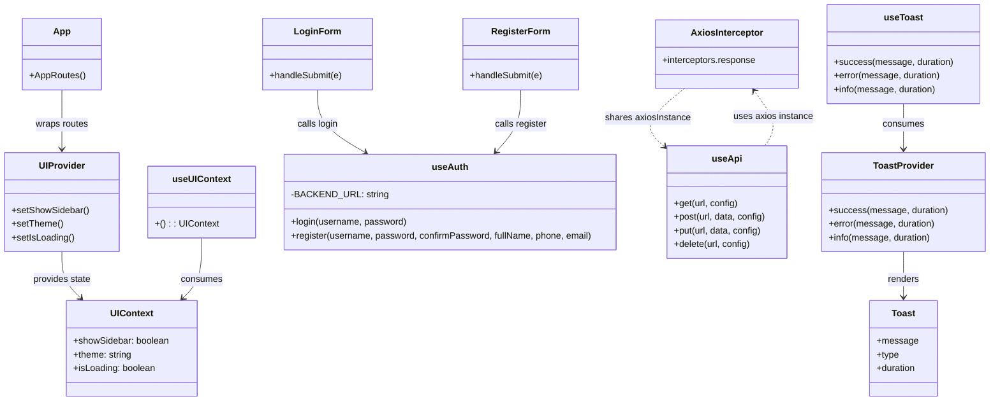

# Class Diagrams (Mermaid)

Mermaid class diagrams for the current codebase. They include the main attributes, key operations, and relationships that already exist in the source.

## 1. Core Domain & Persistence (Backend)

## 2. Authentication, Documents, Security, and API Layer (Backend)

## 3. Frontend State, Auth, API, and Notifications (React)

